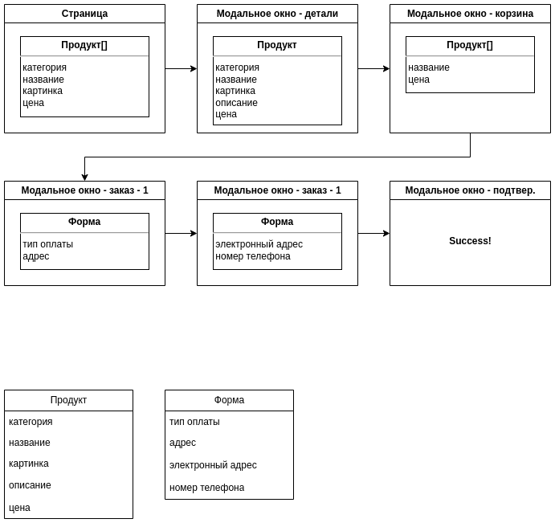
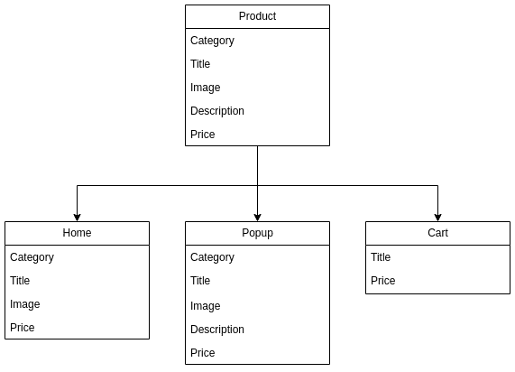
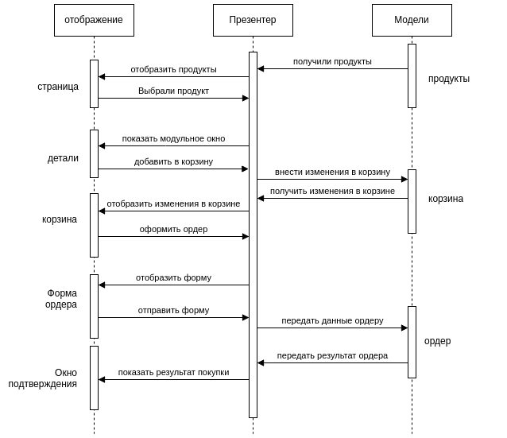

# Проектная работа "Веб-ларек"

Yandex Practicum проект на 8/9 курсе.

Данный проект предназначен для ознакомления в разработке веб-приложений с использованием проектирования MVP подхода.

В этом проекте мы создадим интернет-магазин с товарами для веб-разработчиков — Web-ларёк. В нём можно посмотреть каталог товаров, добавить товары в корзину и сделать заказ.

Важное примечание - данное описание может меняться в процессе разработки проекта. Данный проект создан в рамках 8-ого и 9-й курса.

## Об архитектуре проекта

Взаимодействия внутри приложения происходят через события. Модели инициализируют события, слушатели событий в основном коде выполняют передачу данных компонентам отображения, а также вычислениями между этой передачей, и еще они меняют значения в моделях.
Работа с событиями реализована с помощью класса `EventsEmitter`. В роли пресентера выступает класс `App` внутри которого с помощью событий и реализовывается обновление моделей и отображения в проекте.


## Детали проекта

### Стек

- HTML
- SCSS
- TS
- Webpack

### Структура проекта

- `src/` — исходные файлы проекта
- `src/components/` — папка с JS компонентами
- `src/components/base/` — папка с базовым кодом
- `src/templates/` — папка с HTML-шаблонами 

### Важные файлы

- `src/pages/index.html` — HTML-файл главной страницы
- `src/types/index.ts` — файл с типами
- `src/index.ts` — точка входа приложения
- `src/scss/styles.scss` — корневой файл стилей
- `src/utils/constants.ts` — файл с константами
- `src/utils/utils.ts` — файл с утилитами

### Установка и запуск
Для установки и запуска проекта необходимо выполнить команды

```
npm install
npm run start
```

или

```
yarn
yarn start
```
### Сборка

```
npm run build
```

или

```
yarn build
```

## Анализ проекта WebLarek

### Анализ данных

Проведем анализ данного проекта. В этом проекте у нас всего одна страница. Эта страница включает следующие блоки:

1. Header. Шапка страницы содержит всего 2 компонента: логотип и корзина со счетчиком.
2. Content. Основной контент страницы, содержит каталог товаров.

При нажатии на каталог мы видим модальное окно с подробностями о товаре. В этом окне у нас есть кнопка с действием "В корзину" при нажатии на которое у нас товар добавляется в корзину.

Для того что перейти в корзину, нам нужно нажать на иконку в верхней правой части экрана.

В корзине мы можем удалить продукт либо перейти на форму заказа.

Форма заказа состоит из 2 этапов для заполнения полей: тип оплаты с адресом и электронна почта с номером телефона. После заполнения данных мы можем отправить заказ и получив подтверждение перейти на модальное окно с успешным заказом.

Так какие же данные участвуют в нашем процессе. Для этого ознакомимся с картинкой ниже:



Как видно из картинки у нас есть 2 модели отображения, это "Продукт" и "Форма". Посередине у нас презентер. Его роль в нашем проекте отвечает класс `EventsEmitter`. Через этот класс проходят все события, который позволяют общаться вьюверам с моделями. Рассмотрим модели подробнее.
Продукт у нас имеет такие данные:
- категория;
- название;
- картинка;
- описание;
- цена.

Форма у нас с такими полями:
- тип оплаты;
- адрес доставки;
- электронная почта;
- номер телефона.

При этом продукт у нас отображается в 3 разных представлениях:
- на главной странице в каталоге (отсутствует описание);
- в модальном окне с подробностями о товаре (все поля присутствуют);
- в корзине (отображается только название и цена).
  

Общий процесс взаимодействия нашего приложения можно изобразить такой схемой:



Как видно из рисунка, в нашем приложении будет 3 модели данных:
- Продукты(каталог)
- Корзина
- Ордер

Данное приложение является учебным, поэтому тут будет достаточно нам для работы с API только 2 метода:
- Получить список товаров
- Отправка заказа с его ответом.

В реальной задачи, нам бы понадобились: получение данных клиента, получения данных об оплате, получение всех ордеров, изменение ордеров, получение продукта оп его идентификатору и много другое...

### Анализ API.

Перед тем как приступить к разработке, нам нужно проанализировать API. В этом проекте мы использовали API предоставляемое Yandex.Practicum.
API состоит из следующих методов:
- `GET: /product/` - получение списка товаров;
- `GET: /product/{id}` - получение информации о конкретном товаре;
- `POST: /order` - создание заказа;

Данные которые получаем при получении товара:

```json
{
    "total": 10,
    "items": [
        {
            "id": "854cef69-976d-4c2a-a18c-2aa45046c390",
            "description": "Если планируете решать задачи в тренажёре, берите два.",
            "image": "/5_Dots.svg",
            "title": "+1 час в сутках",
            "category": "софт-скил",
            "price": 750
        },
      "..."
    ] 
}
```

Как видим, если сравнить модель продукта и данные что мы получаем - нам всего хватает.

Для формирования заказа необходимо передать следующие данные:

```json
{
    "payment": "online",
    "email": "test@test.ru",
    "phone": "+71234567890",
    "address": "Spb Vosstania 1",
    "total": 2200,
    "items": [
        "854cef69-976d-4c2a-a18c-2aa45046c390",
        "c101ab44-ed99-4a54-990d-47aa2bb4e7d9"
    ]
}
```

Контактные данные получаем из формы, продукты - из корзины, и общая цена - также из корзины.

В ответ в случае успешного создания заказа получаем:

```json
{
  "id": "98166951-4826-4d8f-a627-18adf7c92acb",
  "total": 2200
}     
```

Значение `total` мы можем использовать на странице подтверждения заказа. Если при заказе у нас возникла ошибка мы получаем:

```json
{
  "error": "Текст ошибки"
}    
```

Исходя из этих мы можем подвести итог, что данных для работы нашего приложения - достаточно и мы можем переходить к следующему шагу, а именно к разработке интерфейсов.

## Ключевые типы данных:

### Тип `TCollectionItem`

Базовый тип данных для хранения данных о перечисляемом продукте, будь то продукт или категория.

```ts
type TCollectionItem = {
  id: string,
  title: string
}
```

### Тип `TProduct`
Данный тип предназначен для хранения данных о продукте. Данный тип используется в таких моделях как список продуктов или список категроий.
Данный тип включает такие поля как: идентификатор продукта(`id`), имя продукта(`title`), цена(`price`), описание(`description`), картинка(`image`), категория(`category`).

```ts
type TProduct = TCollectionItem & {
	
  id: string,
  price: number,
  description: string,
  image: string,
  category: string,
}
```

### Тип `TCategory`
Данный тип предназначен для хранения данных о категории продукта.
`title` - название категории. Оно уникальное для категории, не может быть 2 категории с одним названием.
`slug` - машинный код категории. Используется для формирования класса для категории.

```ts
type TCategory = TCollectionItem & {
  slug: string
};
```

### Перечисляемый тип OrderStatus

Данный тип предназначен для установки статуса заказа. Данный тип используется в модели заказа(`Order`) и может принимать следующие значения:
-  - при создании заказа;
- `PROCESSING` - заказ отправлен на сервер;
- `COMPLETED` - заказ завершен без ошибок;
- `ERROR` - заказ завершен с ошибкой;

```ts
enum OrderStatus {
  CREATED = 'created',
  COMPLETED = 'completed',
  ERROR = 'error',
}
```

### Интерфейс `ICollection`

Данный интерфейс используется для хранения списков продуктов или категорий. Он описывает такие методы как добавление элемента в список, получение по идентификатору, получение всех элементов и удаление элемента по идентификатору.

```ts
interface ICollection<Type> {
  _items: Map<string, Type>;
  addItem(item: Type): void
  getItems(): Type[];
  getItem(id: string): Type | undefined;
  removeItem(id: string): void;
}
```

### Интерфейс `IOrder`

Данный интерфейс используется для хранения данных заказа. 

```ts
interface IOrder {
  payment: string,
  email: string,
  phone: string,
  address: string,
  total: number,
  items: string[]
}
```

### Интерфейс `AppInterface`

Данный интерфейс используется для хранения данных о продуктах, категориях, корзине и метода инициализации.

```ts
interface AppInterface {
  products: ICollection<TProduct>
  categories: ICollection<TCategory>
  basket: string[];
  activeProduct: string | null
  order: Order
}
```

### Интерфейс `IView`

Данный интерфейс используется для отображения данных. Он описывает метод `render`, который выводит темплейт на страницу, а также методов инициализации элементов и событий.

```ts
interface IView {
  render(): HTMLElement;
  initElements():void;
  initEvents():void;
}
```

### Интерфейс `IPage`

Данный интерфейс используется для отображения страницы. блок `counter` - это счетчик, `catalog` - массив элементов каталога, `locked` - флаг блокировки страницы, для запрета скроллинга когда открыто модальное окно.

```ts
interface IPage {
    counter: number;
    catalog: HTMLElement[];
    locked: boolean;
}
```

## Описание классов.

При разработке проекта было использование следующих классов.

### Базовый код

#### Класс `Api`

Базовый класс для работы с API нашего приложения, основными функциями являются получение и отправка данных на сервер с помощью методов `get` и `post`.

##### Конструктор

`constructor(baseUrl: string, options: RequestInit = {})` - конструктор класса. Принимает базовый URL для запросов и опции для запросов. Опции запросов являются необязательными и имеют тип [`RequestInit`](https://developer.mozilla.org/en-US/docs/Web/API/RequestInit) содержат такие опции как `method`, `headers`, `body` и другие.

##### Методы

- `get(uri: string)` - метод для отправки GET-запроса на указанный URL(`uri`). Возвращает Promise, содержащим ответ от сервера.
- `post(uri: string, data: object, method: ApiPostMethods = 'POST')` - метод для отправки POST-запроса на указанный URL(`uri`) с переданными данными(`data`) в виде объекта и методом отправки(`method`) что является необязательным параметром и по умолчанию `POST`. Возвращает Promise, содержащим ответ от сервера.


#### Класс `EventEmitter`

Данный класс используется как утилита, которая позволяет управлять подписками на события. и таким образом помогает.

##### Конструктор

`constructor()` - конструктор класса без входных параметров, который инициализирует пустой список для хранения подписчиков на события.

##### Методы

- `on<T extends object>(eventName: EventName, callback: (event: T) => void)` - метод для подписки на событие. в качестве первого параметра принимает название события, в качестве второго - функцию-обработчик события, где в качестве аргумента нужно указать объект события.
- `off(eventName: EventName, callback: Subscriber)` - метод для отписки от события. в качестве первого параметра принимает название события, в качестве второго - функцию - обработчик события. Тип функции - `Subscriber`, который представляет собой функцию(`Function`).
- `emit<T extends object>(eventName: string, data?: T)` - метод инициализации события. в качестве первого параметра принимает название события, в качестве второго - объект данных события.
- `onAll(callback: (event: EmitterEvent) => void)` - метод для подписки на все события. в качестве первого параметра принимает функцию-обработчик события, где в качестве аргумента нужно данные типа `EmitterEvent` содержащие название события и данные события `{ eventName: string, data: unknown }`.
- `offAll()` - метод для отписки от всех событий. Данный метод заново инициализирует пустой список для хранения подписчиков на события, таким образом сбрасывая все подписки.
- `trigger<T extends object>(eventName: string, context?: Partial<T>)` - метод для генерации события. в качестве первого параметра принимает название события, в качестве второго - объект данных события. Это позволяет передавать его в качестве обработчика события в другие классы. Эти классы будут генерировать события, не будучи при этом напрямую зависимыми от класса `EventEmitter`.

### Классы моделей данных

#### Класс `Collection`

Класс - модель для работы со списком продуктов по сути это просто коллекция продуктов. Основными функциями данного класса являются только получение списка продуктов. Данный класс является производным от интерфейса `ICollection` и имеет все те-же методы.

##### Конструктор

`constructor(products: TProduct[])` - конструктор класса. Принимает массив продуктов.

##### Методы

- `addItem(itme: TProduct)` - метод добавления продукта в список.
- `getItems(): TProduct[]` - метод получения списка продуктов.
- `getItem(id: number): TProduct | undefined` - метод получения продукта по id.
- `removeItem(id: string): void;` - метод удаления продукта из списка по id.


#### Класс `Order`

Класс модель для работы с заказом. Данный клас является потомком от интерфейса `IOrder`.

##### Конструктор

`constructor(basket: IBasketCollection<TProduct>, data: object)` - конструктор класса. Принимает корзину и данные клиента. Данные клиента должны содержать поля `payment`, `phone`, `address`, `email`.

##### Методы

- `setStatus(status: OrderStatus)` - метод для установки статуса заказа. Данный метод вызывается при создании заказа, отправки и получения ответа.
- `getStatus()` - метод для получения статуса заказа.
- `addError(err: string)` - метод для добавления ошибки в заказ. Данный метод вызывается при ошибке при отправке заказа.
- `getErrors()` - метод для получения ошибок в заказе.
- `update(data: object)` - метод для обновления данных заказа.


### Компоненты представления.

Класс - модель для работы с заказом. Основными функциями данного класса отправка заказа на сервер и получение ответа.

#### Класс `View`

Базовый клас для вывода элемента на страницу. Основными функциями являются получение данных элемента и вывод его на страницу.

##### Конструктор

`constructor(container: string | HTMLElement)` - конструктор класса. Принимает контейнер для вывода элемента.

##### Методы

- `initElements()` - абстрактный метод для инициализации элементов.
- `initEvents()` - абстрактный метод для инициализации элементов.
- `render(data?: Partial<Type>): HTMLElement` - метод для вывода элемента на страницу.
- `setText(selector: string | HTMLElement, text: string)` - добавить текст в элемент по селектору.
- `setImageUrl(selector: string | HTMLElement, text: string)` - добавить адрес картинки в элемент `img`.
- `setDataAttribute(attribute: string, value: string, selector?: string | HTMLElement)` - добавить атрибут в элемент.
- `toogleClass(className: string, selector?: string | HTMLElement)` - добавить или удалить класс в элемент.
- `getElement(selector?: string | HTMLElement): HTMLElement` - получить элемент по селектору.

#### Класс `Page`

Производный класс от View основной функцией которого является отображение каталога и счетчика карзины..

##### Конструктор

`constructor(container: string | HTMLElement, protected events: IEvents)` - конструктор класса. Принимает контейнер для вывода страницы и обработчик событий.

##### Методы

- `set counter(value: number)` - сеттер для установки значения счетчика.
- `set products(products: HTMLElement[])` - сеттер для вывода каталога продуктов.
- `set locked(value: boolean)` - сеттер для блокировки скрола на странице при открытии модального окна.

#### Класс `Product`

Производный класс от View основной функцией которого является вывод продукта на страницу согласно его типа(карта, детали или корзина).
Данный класс используется при выводе продукта на главной странице, в корзине и в деталях продукта.

##### Конструктор

`constructor(container: string | HTMLElement, protected events: IEvents)` - конструктор класса. Принимает контейнер для вывода страницы и обработчик событий.

##### Методы

- `render(data?: Partial<Type>): HTMLElement` - метод для вывода продукта на страницу в зависимости от типа. Тип отображения может быть карта, детали или корзина(`cart`, `details`, `basket`).
- `set category` - сеттер для установки категории продукта.
- `get category` - геттер для получения категории продукта.
- `set categoryClass` - сеттер для установки класса категории продукта.
- `set title` - сеттер для установки названия продукта.
- `set image` - сеттер для установки картинки продукта.
- `set price` - сеттер для установки цены продукта.
- `set id` - сеттер для установки id продукта.
- `get id` - геттер для получения id продукта.

#### Класс `ProductPreview`

Производный класс от Product основной функцией которого является вывод продукта в модульном окне просмотра деталей продукта.
Данный класс используется при выводе продукта на главной странице деталях продукта.

##### Конструктор

`constructor(container: string | HTMLElement, protected events: IEvents)` - конструктор класса. Принимает контейнер для вывода страницы и обработчик событий.

##### Методы

- `render(data?: Partial<Type>): HTMLElement` - метод для вывода продукта на страницу в зависимости от типа. Тип отображения может быть карта, детали или корзина(`cart`, `details`, `basket`).
- `set description` - сеттер для установки описания продукта.

#### Класс `ProductBasket`

Производный класс от Product основной функцией которого является вывод продукта в модульном окне корзины продукта.

##### Конструктор

`constructor(container: string | HTMLElement, protected events: IEvents)` - конструктор класса. Принимает контейнер для вывода страницы и обработчик событий.

##### Методы

- `render(data?: Partial<TProductBasket>): HTMLElement` - метод для вывода продукта на страницу в зависимости от типа. Тип отображения может быть карта, детали или корзина(`cart`, `details`, `basket`).
- `set index` - сеттер для установки индекса продукта в корзине.
- `get index` - геттер для получения индекса продукта в корзине.

#### Класс `Modal`

Производный класс от View основной функцией которого является вывод модального окна на страницу.

##### Конструктор

`constructor(container: string | HTMLElement, protected events: IEvents)` - конструктор класса. Принимает контейнер для вывода страницы и обработчик событий.

##### Методы

- `set content` - сеттер для установки контента модального окна.
- `open()` - метод для открытия модального окна.
- `close()` - метод для закрытия модального окна.
- `render(data: IModal): HTMLElement ` - метод для вывода модального окна на страницу.


#### Класс `Basket`

Производный класс от View основной функцией которого является вывод корзины на страницу.

##### Конструктор

`constructor(container: string | HTMLElement, protected events: IEvents) ` - конструктор класса. Принимает контейнер для вывода страницы и обработчик событий.

##### Методы

- `set items` - сеттер для установки продуктов в корзине.
- `set total` - сеттер для установки общей стоимости корзины.
- `render(data?: Partial<Type>): HTMLElement` - метод для вывода корзины на страницу.

#### Классы `Form`

Производный класс от View основной функцией которого является вывод формы на страницу.

##### Конструктор

`constructor(container: string | HTMLElement, protected events: IEvents)` - конструктор класса. Принимает контейнер для вывода страницы и обработчик событий.

##### Методы

- `render(data?: Partial<Type>): HTMLElement` - метод для вывода формы на страницу.
- `set valid` - сеттер для установки валидности формы.
- `set errors` - сеттер для установки ошибок формы.
- `render(state: Partial<Type> & IFormState)` - метод для вывода формы на страницу.

#### Класс `OrderForm`

Производный класс от Form основной функцией которого является вывод формы заказа на страницу.

##### Конструктор

`constructor(container: string | HTMLElement, protected events: IEvents)` - конструктор класса. Принимает контейнер для вывода страницы и обработчик событий.

##### Методы

- `render(state: Partial<Type> & IFormState)` - метод для вывода формы на страницу.
- `set payment` - сеттер для установки способа оплаты.
- `set address` - сеттер для установки адреса доставки.

#### Класс `ContactForm`

Производный класс от Form основной функцией которого является вывод формы контактных данных на страницу.

##### Конструктор

`constructor(container: string | HTMLElement, protected events: IEvents)` - конструктор класса. Принимает контейнер для вывода страницы и обработчик событий.

##### Методы

- `render(state: Partial<Type> & IFormState)` - метод для вывода формы на страницу.
- `set email` - сеттер для установки email.
- `set phone` - сеттер для установки телефона.

#### Класс `Success`

Производный класс от View основной функцией которого является вывод сообщения об успешном заказе на страницу.

##### Конструктор

`constructor(container: string | HTMLElement, protected events: IEvents)` - конструктор класса. Принимает контейнер для вывода страницы и обработчик событий.

##### Методы

- `public render(data?: Partial<Type>): HTMLElement` - вывести результат ордера на страницу
- `set total` - сеттер для установки общей стоимости заказа.

## События

- `products:changed` - событие обновления списка продуктов. Вызывается при обновлении списка продуктов и вызывает перерисовку списка продуктов на странице, а также обновление коллекции продуктов. 
- `product:category-set` - событие обновления категории продукта для установки класса категории продукта. 
- `product:preview` - событие открытия модального окна с деталями продукта.
- `preview:changed` - событие обновления модального окна с деталями продукта.
- `bucket:open` - событие открытия модального окна корзины.
- `basket:add` - событие добавления продукта в корзину.
- `basket:delete` - событие удаления продукта из корзины.
- `basket:changed` - событие обновления корзины.
- `modal:open` - событие открытия модального окна.
- `modal:close` - событие закрытия модального окна.
- `order:open` - событие открытия модального окна заказа.
- `order:change` - событие обновления модального окна заказа.
- `order:submit` - событие отправки данных ордера и перехода к окну с контактными данными.
- `/^order\..*:change/` - событие обновления данных формы заказа.
- `/^contacts\..*:change/` - событие обновления данных формы контактных данных.
- `contacts:change` - событие обновления данных формы контактных данных.
- `contacts:submit` - событие отправки данных контактных данных и отправки заказа.
- `success:close` - событие закрытия модального окна успешного ордера.


