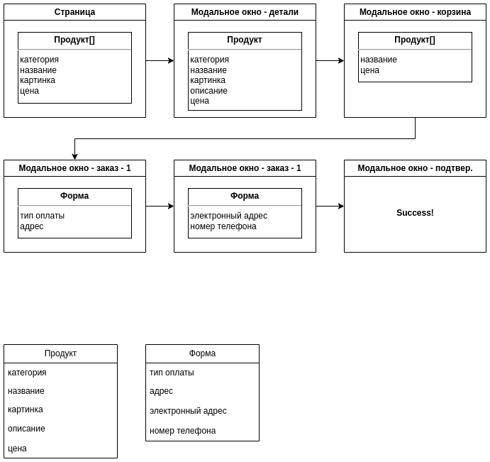
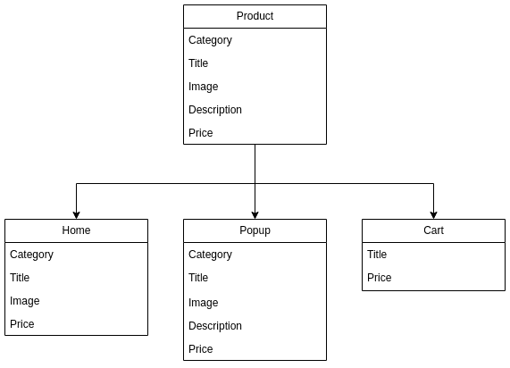
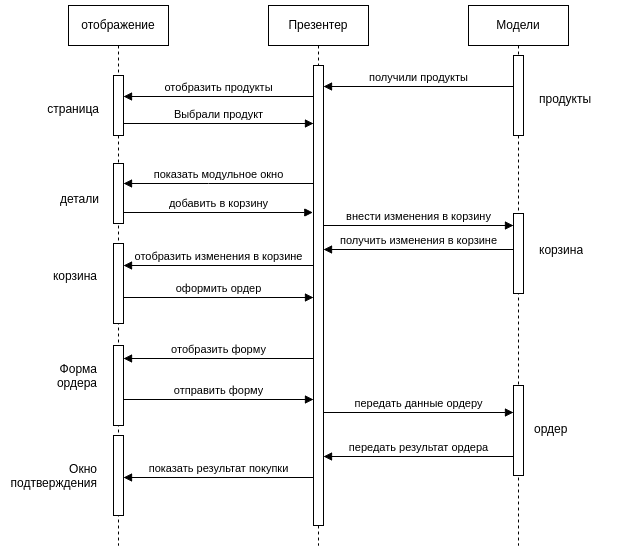

# Анализ проекта WebLarek

## Анализ данных

Проведем анализ данного проекта. В этом проекте у нас всего одна страница. Эта страница включает следующие блоки:

1. Header. Шапка страницы содержит всего 2 компонента: логотип и корзина со счетчиком.
2. Content. Основной контент страницы, содержит каталог товаров. 

При нажатии на каталог мы видим модальное окно с подробностями о товаре. В этом окне у нас есть кнопка с действием "В корзину" при нажатии на которое у нас товар добавляется в корзину.

Для того что перейти в корзину, нам нужно нажать на иконку в верхней правой части экрана.

В корзине мы можем удалить продукт либо перейти на форму заказа.

Форма заказа состоит из 2 этапов для заполнения полей: тип оплаты с адресом и электронна почта с номером телефона. После заполнения данных мы можем отправить заказ и получив подтверждение перейти на модальное окно с успешным заказом.

Так какие же данные участвуют в нашем процессе. Для этого ознакомимся с картинкой ниже:



Как видно из картинки у нас есть 2 модели отображения, это "Продукт" и "Форма". Посередине у нас презентер. Его роль в нашем проекте отвечает класс `EventsEmitter`. Через этот класс проходят все события, который позволяют общаться вьюверам с моделями. Рассмотрим модели подробнее.
Продукт у нас имеет такие данные:
 - категория;
 - название;
 - картинка;
 - описание;
 - цена.

Форма у нас с такими полями:
 - тип оплаты;
 - адрес доставки;
 - электронная почта;
 - номер телефона.

При этом продукт у нас отображается в 3 разных представлениях:
 - на главной странице в каталоге (отсутствует описание);
 - в модальном окне с подробностями о товаре (все поля присутствуют);
 - в корзине (отображается только название и цена).


Общий процесс взаимодействия нашего приложения можно изобразить такой схемой:



Как видно из рисунка, в нашем приложении будет 3 модели данных:
 - Продукты(каталог)
 - Корзина
 - Ордер

Данное приложение является учебным, поэтому тут будет достаточно нам для работы с API только 2 метода:
 - Получить список товаров
 - Отправка заказа с его ответом.

В реальной задачи, нам бы понадобились: получение данных клиента, получения данных об оплате, получение всех ордеров, изменение ордеров, получение продукта оп его идентификатору и много другое...

## Анализ API.

Перед тем как приступить к разработке, нам нужно проанализировать API. В этом проекте мы использовали API предоставляемое Yandex.Practicum.
API состоит из следующих методов:
 - `GET: /product/` - получение списка товаров;
 - `GET: /product/{id}` - получение информации о конкретном товаре;
 - `POST: /order` - создание заказа;

Данные которые получаем при получении товара:

```json
{
    "total": 10,
    "items": [
        {
            "id": "854cef69-976d-4c2a-a18c-2aa45046c390",
            "description": "Если планируете решать задачи в тренажёре, берите два.",
            "image": "/5_Dots.svg",
            "title": "+1 час в сутках",
            "category": "софт-скил",
            "price": 750
        },
      "..."
    ] 
}
```

Как видим, если сравнить модель продукта и данные что мы получаем - нам всего хватает.

Для формирования заказа необходимо передать следующие данные:

```json
{
    "payment": "online",
    "email": "test@test.ru",
    "phone": "+71234567890",
    "address": "Spb Vosstania 1",
    "total": 2200,
    "items": [
        "854cef69-976d-4c2a-a18c-2aa45046c390",
        "c101ab44-ed99-4a54-990d-47aa2bb4e7d9"
    ]
}
```

Контактные данные получаем из формы, продукты - из корзины, и общая цена - также из корзины.

В ответ в случае успешного создания заказа получаем:

```json
{
  "id": "98166951-4826-4d8f-a627-18adf7c92acb",
  "total": 2200
}     
```

Значение `total` мы можем использовать на странице подтверждения заказа. Если при заказе у нас возникла ошибка мы получаем:

```json
{
  "error": "Текст ошибки"
}    
```

Исходя из этих мы можем подвести итог, что данных для работы нашего приложения - достаточно и мы можем переходить к следующему шагу, а именно к разработке интерфейсов.
